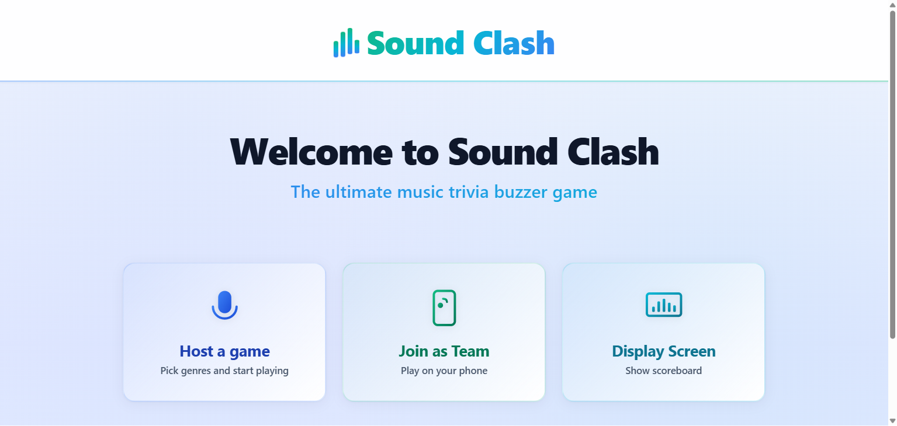
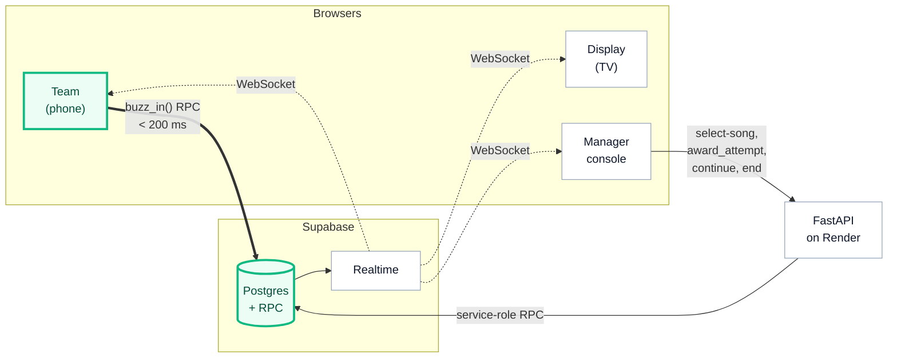

# Sound Clash

Real-time multiplayer music-trivia buzzer game. Host a room, share the code, race to buzz.

**Live: [soundclash.org](https://soundclash.org)**

[](https://github.com/BenArtzi4/Sound-Clash/actions/workflows/backend.yml)
[](https://github.com/BenArtzi4/Sound-Clash/actions/workflows/frontend.yml)
[](https://github.com/BenArtzi4/Sound-Clash/actions/workflows/e2e.yml)
[](https://codecov.io/gh/BenArtzi4/Sound-Clash)
[](LICENSE)



## How it works

Three roles connect to a shared six-character game code, no accounts, no install:

- **Manager** picks genres, advances rounds, and judges answers (Correct Song +10, Correct Artist +5, Wrong −3, Bonus +4)
- **Teams** join from their phones and race to buzz the moment they recognise the YouTube clip
- **Display** is the public scoreboard for the room (projector or TV)

Game state auto-expires four hours after start.

## Architecture

The buzzer is a Postgres `PL/pgSQL` function called directly from the browser via Supabase PostgREST RPC; row-change events fan out to every client over Supabase Realtime. Python is deliberately *not* in the buzzer hot path: that's what keeps end-to-end buzz latency under 200 ms on free hosting. Design notes in [`docs/realtime-design.md`](docs/realtime-design.md).



The thick green path is the buzzer's hot loop, browser straight to Postgres. Everything else can tolerate FastAPI's Render cold-start.

## Stack

| Layer | Tech |
| --- | --- |
| Frontend | React 18, TypeScript, Vite, Cloudflare Pages |
| Backend | Python 3.11, FastAPI, Render |
| Data + Realtime + RPC | Supabase (Postgres 15) |
| Observability | Sentry |
| Pipeline | GitHub Actions runs lint, type-check, tests, and coverage on every push, then triggers Render and Cloudflare Pages deploys on `main` |

## Repository layout

```
backend/         FastAPI service (cold-start-tolerant work only)
frontend/        React SPA
db/migrations/   Numbered, idempotent SQL
docs/            Authoritative spec
tests/           Backend, DB, and Playwright e2e
```

Component map: [`docs/architecture.md`](docs/architecture.md). Game rules: [`docs/game-rules.md`](docs/game-rules.md).
