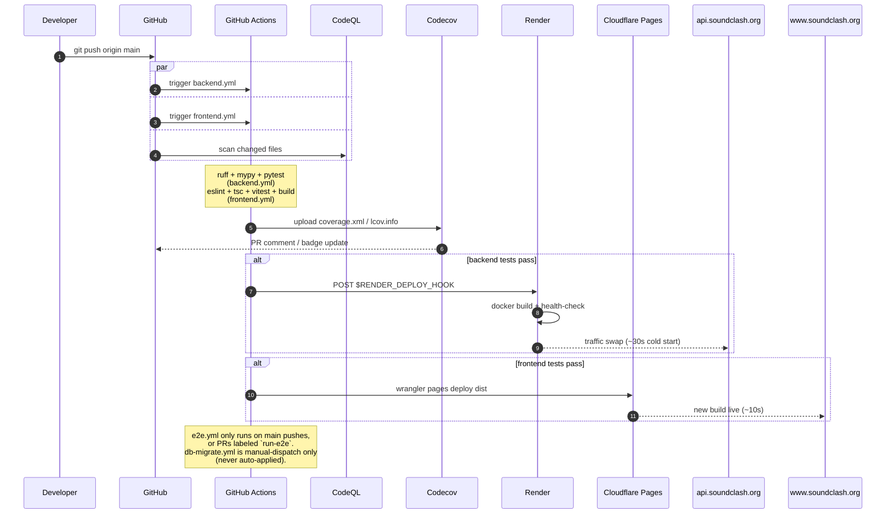

# External Services

The third-party services Sound Clash depends on, and how they're glued together. Internal architecture (browser ↔ FastAPI ↔ Postgres) lives in [`internal.md`](internal.md); this file covers everything *around* the running game: hosting, CI/CD, error tracking, dependency bots, DNS.

> **Total recurring cost**: $12/yr for the domain. Everything else is on a free tier. See `tech-stack.md` for the full quota table and `free-tier-budget.md` for capacity analysis.

## Service map

```mermaid
flowchart LR
    User((Player /<br/>Host /<br/>Display))
    YT[YouTube IFrame<br/>Player API]

    subgraph DNS["DNS &amp; domain"]
        Namecheap[("Namecheap<br/>$12/yr")]
        Cloudflare[Cloudflare DNS<br/>soundclash.org]
    end

    subgraph Frontend["Frontend hosting"]
        Pages[Cloudflare Pages<br/>www.soundclash.org]
    end

    subgraph Backend["Backend hosting"]
        Render[Render web service<br/>api.soundclash.org]
    end

    subgraph Data["Database &amp; realtime"]
        SupaProd[Supabase<br/>Sound-Clash<br/>Frankfurt, prod]
        SupaPreview[Supabase<br/>Sound-Clash-Preview<br/>for E2E]
    end

    subgraph Ops["Ops &amp; observability"]
        Sentry[Sentry<br/>frontend + backend]
        CronJob[cron-job.org<br/>14-min keepalive]
    end

    subgraph Repo["GitHub repo"]
        GH[github.com/<br/>BenArtzi4/Sound-Clash]
        Actions[GitHub Actions<br/>backend / frontend /<br/>e2e / db-migrate]
        CodeQL[CodeQL<br/>Default Setup]
        Dependabot[Dependabot<br/>weekly bumps]
        Codecov[Codecov<br/>coverage badge]
    end

    User -->|HTTPS| Pages
    User -.->|YouTube embed| YT
    Pages -->|REST| Render
    Pages -->|"Realtime WSS<br/>+ PostgREST"| SupaProd
    Render -->|"service-role key"| SupaProd
    CronJob -->|GET /health<br/>every 14 min| Render

    Namecheap -.->|nameservers| Cloudflare
    Cloudflare -.->|"apex 301 → www"| Pages
    Cloudflare -.->|"CNAME api"| Render

    GH -->|webhook on push| Actions
    Actions -->|Render deploy hook| Render
    Actions -->|wrangler pages deploy| Pages
    Actions -.->|coverage.xml| Codecov
    Actions -.->|psql migrate.sh<br/>(manual dispatch)| SupaProd
    Actions -->|Playwright E2E| SupaPreview
    GH -.->|on push / PR| CodeQL
    Dependabot -.->|opens PRs| GH

    Pages -.->|JS errors| Sentry
    Render -.->|Python errors| Sentry

    classDef paid fill:#ffe0e0,stroke:#cc0000,color:#000
    classDef free fill:#e8f5e9,stroke:#2e7d32,color:#000
    classDef ci fill:#e3f2fd,stroke:#1565c0,color:#000
    class Namecheap paid
    class Pages,Render,SupaProd,SupaPreview,Sentry,CronJob,YT free
    class GH,Actions,CodeQL,Dependabot,Codecov ci
```

**Legend**: red = paid (just the domain), green = free-tier services in the request path, blue = developer/CI infrastructure that doesn't sit on the request path.

## Service inventory

| Service | Used for | Plan | Auth surface |
|---|---|---|---|
| **Namecheap** | Domain registration of `soundclash.org` | $12/yr | Account login |
| **Cloudflare DNS** | Authoritative DNS, apex redirect, CNAME for `api.soundclash.org` | Free | API token (`CF_API_TOKEN`) |
| **Cloudflare Pages** | Static hosting of the React SPA at `www.soundclash.org` | Free (unlimited bandwidth, 500 builds/mo) | API token + account ID |
| **Render** | FastAPI Docker service at `api.soundclash.org` | Free (750 hr/mo, 512 MB, 15-min idle sleep) | Deploy webhook (`RENDER_DEPLOY_HOOK`) |
| **Supabase (prod)** | Postgres + Realtime + PostgREST | Free (500 MB DB, 200 concurrent peers, 2M msgs/mo) | anon key (browser), service-role key (server) |
| **Supabase (preview)** | Isolated project for Playwright E2E | Free | Separate anon + service-role secrets |
| **GitHub Actions** | CI/CD for all four workflows | Free for public repos | `GITHUB_TOKEN` per run |
| **CodeQL** | Security static analysis | Free for public repos (Default Setup) | none (runs as a check) |
| **Dependabot** | Weekly dependency PRs | Free | none (built into GitHub) |
| **Codecov** | Coverage delta comments + badge | Free for public repos | `CODECOV_TOKEN` upload secret |
| **Sentry** | Error tracking (`sound-clash-frontend` + `sound-clash-backend`) | Free (5k errors/mo, 10k perf events) | DSN per project |
| **cron-job.org** | Pings `/health` every 14 min so Render doesn't sleep | Free | Account login |
| **YouTube IFrame Player API** | Audio playback (browser-direct) | Free, terms apply | none (public CDN) |

## Deploy flow: what happens on `git push main`



## What goes into which secret store

Every credential lives in **exactly one** of these places (no duplication, no committed `.env`):

| Secret | GitHub Actions | Render env | Cloudflare Pages env | Local `.env` |
|---|:-:|:-:|:-:|:-:|
| `SUPABASE_URL` | ✅ | ✅ | – | ✅ (dev) |
| `SUPABASE_ANON_KEY` | ✅ | – | – | ✅ (dev) |
| `SUPABASE_SERVICE_ROLE_KEY` | ✅ | ✅ | **never** | ✅ (dev) |
| `SUPABASE_PREVIEW_*` | ✅ | – | – | – |
| `ADMIN_PASSWORD` | ✅ (preview) | ✅ | – | ✅ (dev) |
| `RENDER_DEPLOY_HOOK` | ✅ | – | – | – |
| `CF_API_TOKEN` / `CF_ACCOUNT_ID` | ✅ | – | – | – |
| `SENTRY_DSN_BACKEND` | – | ✅ | – | optional |
| `SENTRY_DSN_FRONTEND` | – | – | ✅ | optional |
| `CODECOV_TOKEN` | ✅ | – | – | – |
| `VITE_SUPABASE_URL` | – | – | ✅ | ✅ (dev) |
| `VITE_SUPABASE_ANON_KEY` | – | – | ✅ | ✅ (dev) |
| `VITE_API_URL` | – | – | ✅ | ✅ (dev) |

The full secret rotation procedure is in `runbook.md` §3.

## What is **not** in this diagram

- **CDN for YouTube** — YouTube IFrame Player loads its own JS from `youtube.com`; there's no separate CDN dependency we manage.
- **Email** — there is no transactional email in the system. Only ops alerts (Sentry "new issue", Render failure, Supabase quota) email the workspace owner directly.
