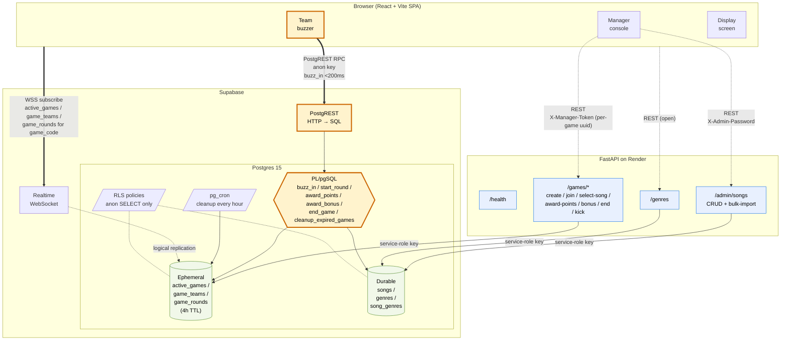
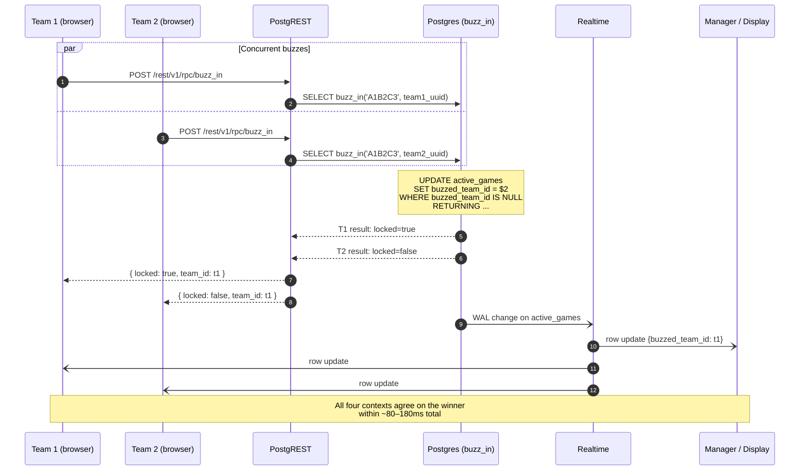

# Internal Architecture

What lives inside the running game: how the React frontend, FastAPI backend, and Supabase Postgres talk to each other, and what travels over each edge.

> **The single most important detail**: the buzzer (`buzz_in`) goes browser → Supabase **directly**, bypassing FastAPI entirely. That's how a <200ms hot path coexists with free-tier Python hosting that has 2–30s cold starts. See `realtime-design.md` for the full reasoning.

## Component map

**Legend**

- **Yellow / thick edges** = the buzzer hot path. Browser fires `supabase.rpc('buzz_in', ...)` over PostgREST; Postgres does an atomic conditional `UPDATE`; Realtime fans the row change to all subscribers. No Python in the loop.
- **Blue / dashed edges** = REST traffic to FastAPI. Cold-start tolerant: game creation, song selection, scoring, admin CRUD. Always uses the service-role key server-side.
- **Solid arrows** = synchronous request/response. **Dashed arrows** = subscription / pub-sub.

## Auth surfaces (who can hit what)

| Caller | Path | Header / key | Why |
|---|---|---|---|
| Anonymous browser | `POST /games` | none | Open hosting; returns the per-game `manager_token` |
| Anonymous browser | `POST /games/{code}/teams` | none | Players just need to know the code |
| Anonymous browser | `supabase.rpc('buzz_in')` | anon JWT (RLS) | Hot path; the only RPC `anon` is `GRANT EXECUTE`d on |
| Anonymous browser | `SELECT` on game-scoped rows | anon JWT (RLS) | RLS allows SELECT, denies all writes |
| Manager browser | `POST /games/{code}/{select-song,award-points,bonus,end}` | `X-Manager-Token` | Per-game uuid stored on `active_games`, mirrored in localStorage |
| Manager browser | `DELETE /games/{code}/teams/{team_id}` | `X-Manager-Token` | Same |
| Admin browser | `/admin/songs/*` | `X-Admin-Password` | Single env-var password, constant-time compared |
| FastAPI itself | Anything via `supabase-py` | service-role key | Server-side only; never reaches the browser bundle |

The `manager_token` was added in 2026-05-06 (`migrations/012_manager_token.sql`) when the global manager-password gate was retired in favour of open hosting.

## Hot-path sequence: a buzz race

Two teams click the buzzer within ~50ms of each other. Postgres serializes them and exactly one wins. The other clients learn the result over Realtime.

Why this works: Postgres' `UPDATE ... WHERE buzzed_team_id IS NULL` is atomic at row level. The first call to land sets the field; the second sees zero rows affected and returns `locked=false`. There is no separate read-then-write that could lose to a race.

## What's deliberately **not** here

- No object storage. Audio is YouTube IFrame Player only; the catalog stores `youtube_id` + `start_time`.
- No state-management library. React local state + Supabase Realtime is the entire client model.
- No user accounts or JWT identity. The two credentials in the system (`X-Manager-Token`, `X-Admin-Password`) are scoped to specific surfaces; there is no profile, no login, no session.
- No WebSocket service in FastAPI. Supabase Realtime is the broadcast plane.
